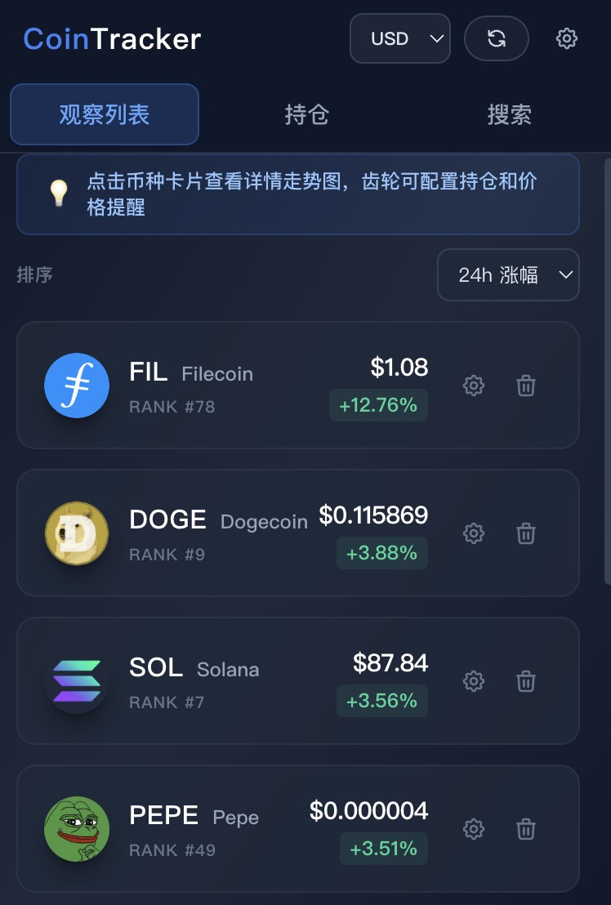
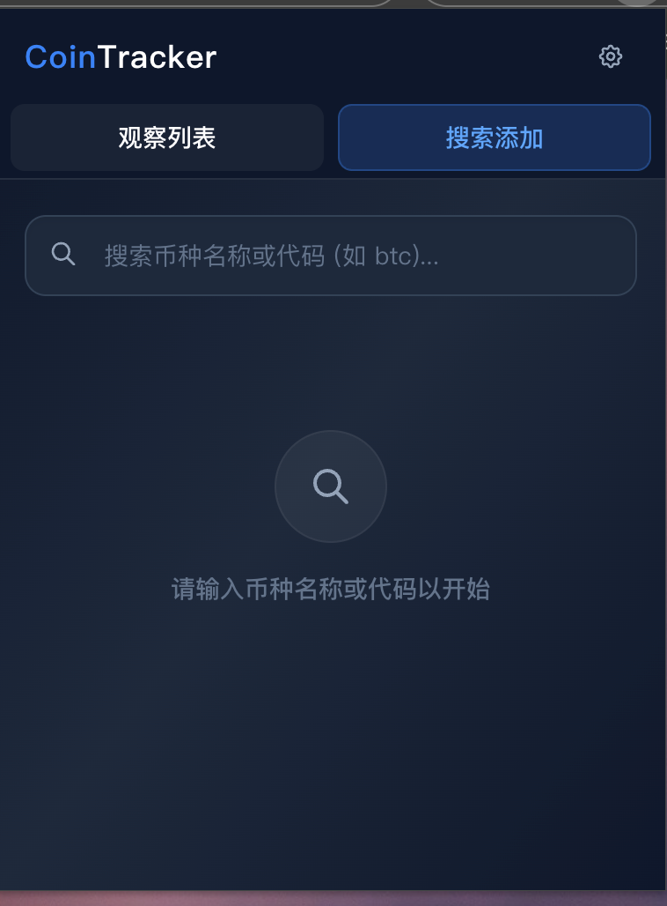
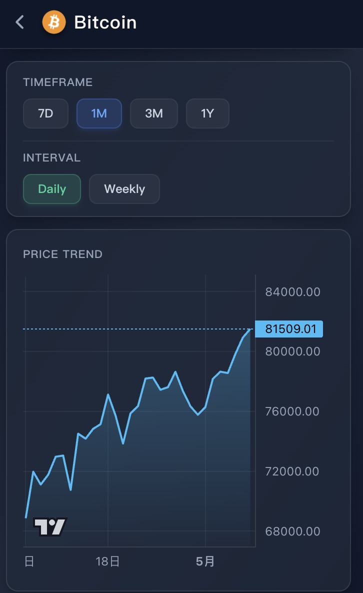

# CoinTracker - 加密货币Chrome扩展

一个现代化的加密货币价格追踪Chrome扩展，支持实时价格显示、K线图分析和智能缓存功能。

## 🖼️ UI 预览 (v2.0 极客暗黑屏)

<table>
  <tr>
    <td align="center">
      
      <br/>
      <b>主界面 - 观察列表</b>
    </td>
    <td align="center">
      
      <br/>
      <b>高级搜索与添加</b>
    </td>
    <td align="center">
      
      <br/>
      <b>币种趋势详情页</b>
    </td>
  </tr>
</table>

## 🚀 功能特性

- ✅ **实时价格显示** - 支持多种加密货币的实时价格监控
- ✅ **K线图分析** - 集成lightweight-charts，提供专业的价格走势图
- ✅ **搜索添加** - 快速搜索并添加关注的币种
- ✅ **价格提醒** - 设置价格阈值提醒（规划中）
- ✅ **智能缓存** - 多层缓存机制，优化API请求频率
- ✅ **频率限制保护** - 智能请求队列，防止API限制

## � 技术栈

- **Frontend**: React 18 + TypeScript + Tailwind CSS
- **Charts**: Lightweight Charts 4.2.0
- **Build**: Webpack 5 + Chrome Extension Manifest V3
- **API**: CoinGecko API (免费版)

## 🔧 安装步骤

### 1. 构建项目
```bash
npm install
npm run build
```

### 2. 安装到Chrome
1. 打开 Chrome 浏览器
2. 访问 `chrome://extensions/`
3. 开启右上角"开发者模式"
4. 点击"加载已解压的扩展程序"
5. 选择项目的 `dist` 文件夹
6. 扩展安装完成！

## 🐛 故障排除

### 问题：扩展一直显示"加载中"

这个问题通常有以下几个原因：

#### 1. Service Worker 未启动
**检查方法**：
```
1. 打开 chrome://extensions/
2. 找到 CoinTracker 扩展
3. 点击"详情"
4. 查看 "检查视图" 部分是否有 "Service Worker" 
5. 点击 "Service Worker" 查看控制台
```

#### 2. 权限问题
**解决方案**：
- 确认扩展有访问 `api.coingecko.com` 的权限
- 检查 `manifest.json` 中的 `host_permissions` 设置

#### 3. API连接问题
**测试方法**：
- 打开项目根目录的 `test-extension.html` 文件
- 点击"测试 CoinGecko API"按钮
- 查看API是否可以正常访问

#### 4. 调试步骤
1. **查看popup控制台**：
   ```
   右键点击扩展图标 → 检查 → Console标签
   ```

2. **查看background控制台**：
   ```
   chrome://extensions/ → CoinTracker详情 → Service Worker
   ```

3. **查看详细日志**：
   ```
   所有console.log消息都已添加，方便调试
   ```

## � 技术优化

### API频率限制解决方案

#### 1. 请求队列管理
- 使用`RequestQueue`类管理所有API请求
- 确保请求之间有1.5秒的间隔
- 避免并发请求导致的429错误

#### 2. 智能缓存系统
- **价格数据**: 3分钟缓存，平衡实时性和API使用
- **搜索结果**: 15分钟缓存，减少重复搜索的API调用
- **历史数据**: 10分钟缓存，K线图数据更新频率适中
- **趋势数据**: 30分钟缓存，趋势数据变化相对较慢

#### 3. 错误处理和重试
- 检测429状态码，自动延迟重试
- 用户友好的错误提示
- 优雅降级，确保基本功能可用

## � 开发命令

```bash
# 安装依赖
npm install

# 开发构建（包含source map）
npm run dev

# 生产构建
npm run build

# 监听模式（自动重新构建）
npm run watch
```

## 📁 项目结构

```
coin/
├── src/
│   ├── background/          # Service Worker (后台脚本)
│   ├── popup/              # 弹窗界面
│   ├── services/           # API服务
│   └── types/              # TypeScript类型定义
├── public/
│   ├── manifest.json       # 扩展清单文件
│   └── icons/             # 图标文件
├── dist/                  # 构建输出目录
└── test-extension.html    # API测试页面
```

## � 已修复的问题

- ✅ **API频率限制 (429错误)**：增加了请求队列和缓存机制
- ✅ **智能缓存**：不同类型数据使用不同缓存时长  
- ✅ **友好错误提示**：用户友好的中文错误信息
- ✅ **自动重试**：遇到限制时自动延迟重试
- ✅ **Service Worker 通信**：增加PING机制确保后台脚本就绪

## 💡 使用提示

- 点击币种名称可查看K线图详情
- 支持7天、30天、90天、1年的K线图
- 数据会自动缓存，减少API调用
- 如遇到"API请求过于频繁"提示，请等待几分钟后再试

---

*享受您的数字货币追踪体验！* 🚀💰
